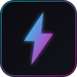

# 🚀 ShopeeHunter Chrome Extension

A beautiful, modern Chrome extension for scraping Shopee products. This extension bypasses bot detection by using your real browser session.



## ✨ Features

- **🎨 Modern UI**: Glassmorphism design with smooth animations
- **⚡ Fast Scraping**: Uses your real browser session, no bot detection
- **📊 Real-time Progress**: Live logs and statistics
- **🔄 Auto-scroll**: Automatically loads all products on page
- **💾 Backend Integration**: Sends data directly to ShopeeHunter dashboard

## 📦 Installation

### Step 1: Generate Icons

1. Open `icons/generate-icons.html` in Chrome browser
2. Right-click each icon and save as:
   - `icon16.png` (16x16)
   - `icon48.png` (48x48)
   - `icon128.png` (128x128)

### Step 2: Load Extension in Chrome

1. Open Chrome and go to `chrome://extensions/`
2. Enable **Developer mode** (toggle in top-right corner)
3. Click **Load unpacked**
4. Select the `shopee-extension` folder
5. The extension icon should appear in your toolbar

### Step 3: Pin the Extension

1. Click the puzzle piece icon in Chrome toolbar
2. Find "ShopeeHunter" and click the pin icon

## 🎮 Usage

### Basic Scraping

1. **Login to Shopee**: First, login to your Shopee account at [shopee.co.id](https://shopee.co.id)

2. **Open Extension**: Click the ShopeeHunter icon in your toolbar

3. **Check Status**: The extension should show "Connected to Shopee" with a green indicator

4. **Enter Keyword**: Type your search keyword (e.g., "headphone bluetooth")

5. **Set Pages**: Use the slider to select how many pages to scrape (1-10)

6. **Start Scraping**: Click the "Start Scraping" button

7. **Watch Progress**: See real-time logs and statistics

8. **View Results**: After completion, click "Open Dashboard" to see your scraped products

### Filters

- **🎬 Video Only**: Only scrape products that have video
- **⭐ Min 4.0 Rating**: Only scrape products with rating ≥ 4.0

## 🛠 Configuration

### Backend URL

The extension sends data to `http://localhost:8000/api`. To change this:

1. Open `scripts/background.js`
2. Edit the `CONFIG.BACKEND_URL` value

### Preferences

Your settings (max pages, filters) are automatically saved and restored.

## 📂 File Structure

```
shopee-extension/
├── manifest.json          # Extension configuration
├── popup/
│   ├── popup.html         # Popup UI
│   ├── popup.css          # Styles (glassmorphism)
│   └── popup.js           # Popup logic
├── scripts/
│   ├── background.js      # Service worker
│   └── content.js         # Page scraping
├── icons/
│   ├── icon16.png
│   ├── icon48.png
│   ├── icon128.png
│   └── generate-icons.html
└── README.md
```

## 🔧 Troubleshooting

### Extension shows "Not on Shopee"

Make sure you're on a shopee.co.id page before opening the extension.

### No products found

- Make sure you're logged in to Shopee
- Try searching on the Shopee website first
- Check if products appear on the page

### Backend connection error

- Make sure the backend is running: `cd backend && python -m uvicorn app.main:app`
- Check if localhost:8000 is accessible

### Extension not appearing

- Go to `chrome://extensions/`
- Make sure the extension is enabled
- Try clicking "Reload" on the extension

## 🔒 Privacy

This extension:
- Only runs on Shopee pages
- Only collects product data (not personal info)
- Sends data only to your local backend
- Does not track or share any data

## 📝 License

Part of the ShopeeHunter project.
